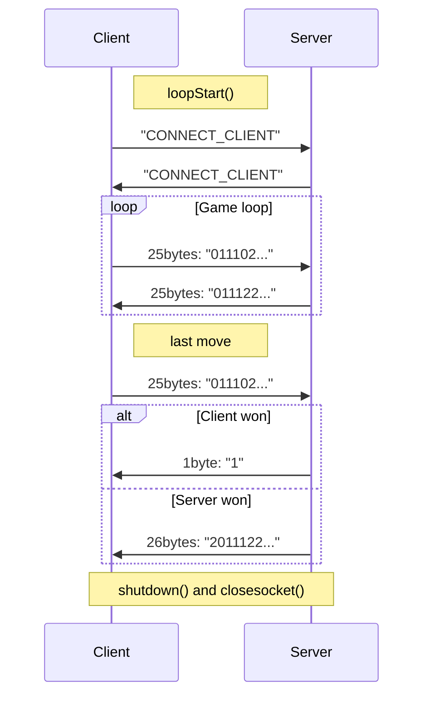

# LAB1 Variant №12 Mishcuk Roman

## About
This is the repository, containing the solution of the first laboratory task of Computer networks course.
In it the abstract multithreaded winsock communication model was implemented.
The following subtopics describe the communication model used.

## Постановка задачі

Потрібно:
1.  Вивчити роботу із сокетами (принципи, функції підтримки роботи з WinSock, див. теоретичні відомості).
2.  Розробити протокол обміну даними для свого варіанту: сценарій обміну даними та його команди (через сокет передається просто повідомлення, а що з ним робити визначають команди).
3.  Розробити дві програми, так звані програма-клієнт (далі просто **_клієнт_**) та програма-сервер (далі просто **_сервер_**). Ці дві програми, працюючи на різних робочих станціях (вузлах) мережі, мають обмінюватися командами, згідно розробленого автором протоколу, використовуючи механізм сокетів у профілі TCP/IP
4.  Має бути передбачена реакція на помилкові команди
5.  Номер порта призначачення вибирати так: **№\_порта = 1031**
6.  Всі варіанти мають підтримувати команду із ім'ям _Who_, у відповідь на яку сервер дає інформацію про автора та номер і коротку назву варіанту
7.  Клієнт та сервер мають для кожного відісланого/прийнятого сокет-повідомлення робити запис у системний журнал (текстовий файл) про: час дії, команда(и) повідомлення.
8.  Формат сокет-повідомлень такий:

| Заголовок | Дані |
|-|-|
    
9. Формат заголовока та розміри полів:

| Довжина заголовка (в байтах) | Команда1 [; Команда2; ...] |
|-|-|
|1 байт|до 255 байт|
    
   Зрозуміло, якщо у заголовку не буде команд, то все одно має бути один байт довжини заголовка (і дорівнювати 1). Як правило, у повідомленні буде одна команда (у \[...\] необов'язкові елементи). Команда може мати операнди, тоді синтаксис таких команд розробити самостійно.
    

**У звіті до лабораторної має бути**:

1.  описаний протокол (структура пакета обміну, команди, формати даних, діаграма станів сценарію пари клієнт/сервер),
2.  тексти програм (клієнта, сервера),
3.  тексти файлу протоколу (системного журналу дій програми) для клієнта та для сервера (для звіту блоки однакових команд у журналі доцільно скоротити).

## Variant specific tasks:
##### Variant 12 Гра "хрестики-нолики".
**№\_порта = 1037**

Гра "хрестики-нолики" на полі 5х5 клітинок. Один гравець - на сервері, другий - на клієнті. Поле (матрицю символів) до клієнта передає сервер. Сервер робить хід у будь-яку пусту клітинку, стратегія не потрібна, перемогу/програш не відслідковує. Після кожного ходу клієнта сервер передає поле, додавши свій хід. Клієнт в ході гри може її завершити в будь-який момент.

## Protocol look
